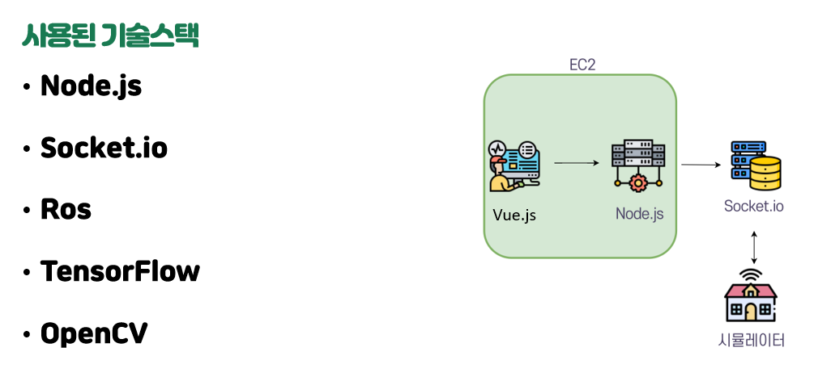
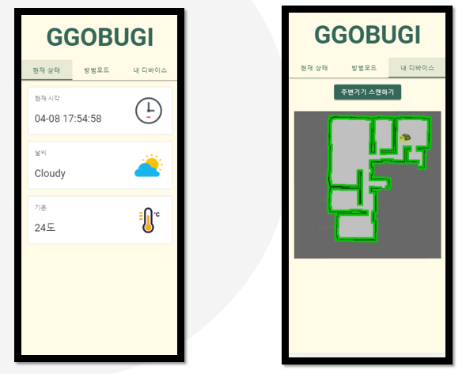

# SSAFY 4th 특화 프로젝트 IOT - 꼬부기

**현재 삼성측에 문의를 하여 코드반출 검사를 진행 중 입니다. 따라서 4월 중순쯤에 코드가 업로드 될 예정입니다.**

>  Ros2를 활용한 프로젝트

## 제작기간

> 21.03.01 ~ 21.04.09 (6주)

## 참여 인원

| 역할           | 이름   |
| -------------- | ------ |
| 팀장, 판단제어 | 빈준호 |
| 판단제어       | 문진환 |
| 판단제어       | 최진영 |
| 인지           | 윤승환 |
| 인지           | 윤건상 |

## 프로젝트 소개

> 1인 가구의 증가로 인해 가정용 홈 카메라의 필요성이 증가하였습니다. 
> 이로 인해  방범 기능과 손 쉽게 IoT기기를 조작 할 수 있는 터틀봇을 기획하기로 결정했습니다.

## 프로젝트 시연 동영상

https://drive.google.com/file/d/1FMOtOF1SOQvR75AMcaXEMUFybiSNg8g1/view?usp=sharing

## 사용된 기술 스택

원래대로 라면 SSAFY에서 터틀봇을 제공하여 실제환경에서 IoT기기를 조작하며 프로그래밍 하기로 예정이었지만, COVID19로 인해 비대면으로 프로젝트가 진행되었습니다. 그러므로 아쉽게도 터틀봇은 지원 못 받았고, 가상의 시뮬레이터 환경에서 프로젝트를 진행하게 되었습니다.

따라서 Ros2 기술을 활용하여 시뮬레이터와 통신하며 프로젝트를 진행했습니다.

## 프로젝트 흐름도

## 기능 설명

> 집안 상태 확인

Vue.js로 구현했으며, 시뮬레이터의 환경을 그래로 보여줍니다.

> IoT 기기 조작 기능

설명: socket통신을 통해  명령을 내리면 IoT기기들을 ON,OFF할 수 있습니다.

> 방범 모드

설명: tensorflow를 사용하여 사람을 인식하면 사진을 저장했다가,  web 인터페이스에  업로드된 도둑 사진을 확인 가능합니다.

.gif)

>웹 인터페이스로 원격 이동 기능

설명: 웹 인터페이스에서 클릭 시, 원격으로 시뮬레이터 환경에서 동일한 위치로 이동가능합니다.

## 맡은 역할

- 로봇의 최단거리 알고리즘 구현
- Node.js를 활용한 시뮬레이터와 FE를 연결해주는 전반적인 server구현
- 방범기능 Server API 구현